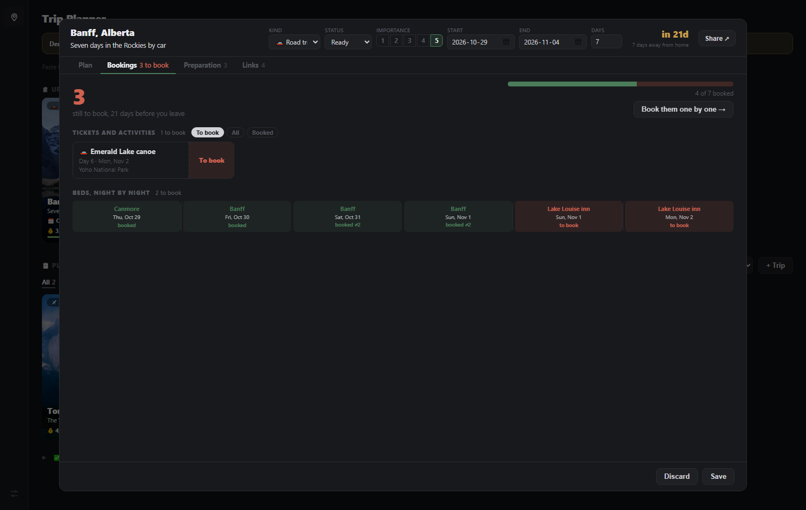

# Trip Planner

Every trip on one board, and every trip planned day by day: what you do, how long it takes, how far
you drive, where you sleep and what is still to book. One HTML file that opens in a browser: no
build step, no backend, no account.

**Live demo:** https://dereckcb.github.io/trip-planner/ - the trips are made up, and anything you
change stays in your own browser.

---

## The board

- **Upcoming** holds every trip with dates, soonest first, each with a live countdown ("in 21 days").
- **Planned** holds the ideas without dates yet, sorted by how much you want them, and filterable by
  kind: travel, road trip or event. Drag a trip between the two: onto Upcoming it asks when it
  starts; back to Planned it keeps the plan and drops the dates.
- **Done** folds away the trips you have taken.
- **Each card is a photo** with the destination, dates, length and **what is left of the budget**
  (red once you are over). Hover a card for the first stops of its plan.
- **Paste to create**: paste trip details anywhere on the page and a new card opens already filled in.

## A trip, a week at a time

Open a card and the plan is a **calendar**: seven days side by side, 07:00 to 02:00, and a whole
day fits in the window without scrolling. The arrows move a week at a time.

- **Every stop sits at its time**, as tall as it lasts. Set a start time, or leave it empty and it
  follows the stop before it.
- **The way there is drawn in front of each stop**: a dashed block with the mode (car, train, metro,
  flight, walk...), how long it takes, and the route when you hover it.
- **Activities to place**: a pool of ideas above the calendar. Drag one onto a day and a line shows
  the exact time it will land on; drag stops between days, or back to the pool.
- **Hover anything** for the full detail, **click** to change it. Each day's header says where you
  sleep that night.
- **Colour means one thing**: grey unless it is about a booking. Red is still to book, green is booked.
- **Timeline** and **Board** views are one click away for a different read of the same plan.

## Bookings, one by one

A tab for everything that has to be paid for before you go:

- **How many are left**, how many days before you leave, and a progress bar.
- **Ticket cards** for every activity marked "has to be reserved", stamped *To book* or *Booked*.
- **Beds, night by night**: one cell per night. Three nights in the same place is one booking, not three.
- **Book them one by one**: opens the first open booking, and **Booked, next** saves it and moves to
  the next. The confirmation number, the booking page and the document itself live on each one.

Also on the card: **Preparation** (the photo and description, who is coming, budget, a checklist)
and **Links** (every useful page, described). **Share** turns the trip into one printable page, or
text to paste into an email.

---

## Under the hood

- One HTML file. Open it and it runs - no install, no server, no network needed.
- Everything saves to your browser under `trips_state`. Settings has a JSON **Backup** and
  **Restore**, and a rolling ring of the last states as a safety net. Documents attached to a booking
  stay on the device that added them.
- Optional: add Supabase keys at the top of the script and it switches on accounts and cross-device
  sync, with versioned history. Without keys it stays in demo mode - no login, no network. See
  `SETUP.md`.
- Light and dark, and it works on a phone.

## Photo credits

The demo trip photos are freely licensed, from Wikimedia Commons:

| Trip | License | Author |
|---|---|---|
| Banff | Public domain | Gorgo |
| Dolomites | CC BY-SA 3.0 | Wolfgang Moroder |
| Yosemite | CC BY-SA 3.0 | Diliff |
| Torres del Paine | CC BY 2.0 | Winky from Oxford, UK |
| Cabot Trail | CC BY-SA 2.0 | Tony Webster from San Francisco, California |
| Vancouver | CC BY-SA 2.5 ca | The Cosmonaut |

## Part of a set

Small, separate apps that share a look but nothing else - separate data, separate repos:

| App | Repo |
|---|---|
| Task Tracker | https://github.com/DereckCB/task-tracker |
| Job Search | https://github.com/DereckCB/job-search |
| Trip Planner | this one |
| Household Budget | https://github.com/DereckCB/household-budget |

## License

MIT (c) 2026 Dereck Barinotto
