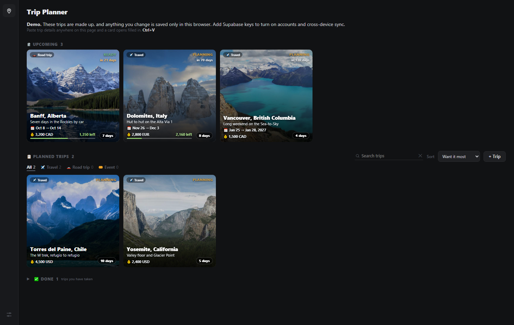
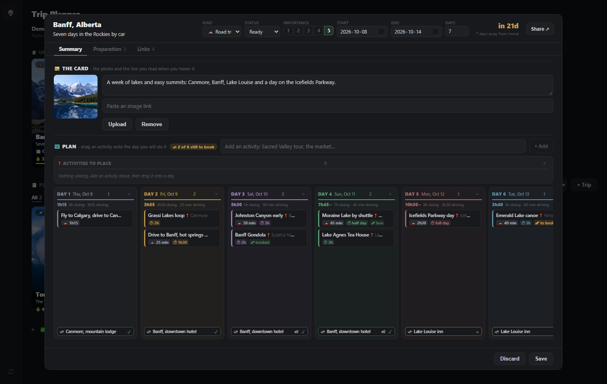

# Trip Planner

Every trip on one board, and every trip planned day by day: what you do, how long it takes, how far
you drive, where you sleep and what is still to book. One HTML file that opens in a browser: no
build step, no backend, no account.

**Live demo:** https://dereckcb.github.io/trip-planner/ - the trips are made up, and anything you
change stays in your own browser.

---

## The board

- **Upcoming** holds every trip with dates, soonest first, each with a live countdown ("in 21 days").
- **Planned** holds the ideas without dates yet, sorted by how much you want them, and filterable by
  kind: travel, road trip or event. Drag a trip between the two: onto Upcoming it asks when it
  starts; back to Planned it keeps the plan and drops the dates.
- **Done** folds away the trips you have taken.
- **Each card is a photo** with the destination, dates, length and **what is left of the budget**
  (red once you are over). Hover a card for the first stops of its plan.
- **Paste to create**: paste trip details anywhere on the page and a new card opens already filled in.

## A trip, day by day

Open a card and the plan is laid out as **one column per day**:

- **Activities** are dragged onto the day you will do them. Each one carries where it is (a click
  opens it in Google Maps), how long it takes, and the drive to get there.
- **Every day adds itself up**: hours doing, hours driving, so an overloaded day is obvious before
  you are living it.
- **Bookings**: anything that needs a ticket is marked *to book* until you tick it and add the
  reference. The header counts what is still open.
- **Where you sleep**, night by night, at the bottom of each day. Three nights in the same place is
  one booking, not three copies of it.
- **Preparation**: a checklist you tick as things get done. **Links**: every useful page, described.
- **Share**: the whole trip as one printable page, or text to paste into an email.

---

## Under the hood

- One HTML file. Open it and it runs - no install, no server, no network needed.
- Everything saves to your browser under `trips_state`. Settings has a JSON **Backup** and
  **Restore**, and a rolling ring of the last states as a safety net. Documents attached to a booking
  stay on the device that added them.
- Optional: add Supabase keys at the top of the script and it switches on accounts and cross-device
  sync, with versioned history. Without keys it stays in demo mode - no login, no network. See
  `SETUP.md`.
- Light and dark, and it works on a phone.

## Photo credits

The demo trip photos are freely licensed, from Wikimedia Commons:

| Trip | License | Author |
|---|---|---|
| Banff | Public domain | Gorgo |
| Dolomites | CC BY-SA 3.0 | Wolfgang Moroder |
| Yosemite | CC BY-SA 3.0 | Diliff |
| Torres del Paine | CC BY 2.0 | Winky from Oxford, UK |
| Cabot Trail | CC BY-SA 2.0 | Tony Webster from San Francisco, California |
| Vancouver | CC BY-SA 2.5 ca | The Cosmonaut |

## Part of a set

Small, separate apps that share a look but nothing else - separate data, separate repos:

| App | Repo |
|---|---|
| Task Tracker | https://github.com/DereckCB/task-tracker |
| Job Search | https://github.com/DereckCB/job-search |
| Trip Planner | this one |
| Household Budget | https://github.com/DereckCB/household-budget |

## License

MIT (c) 2026 Dereck Barinotto
